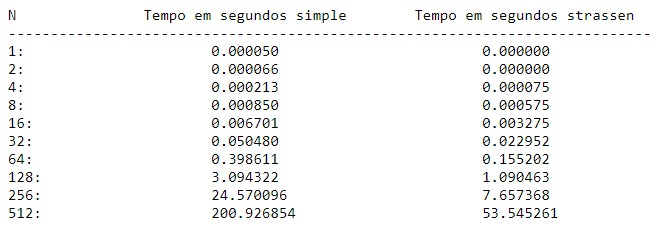
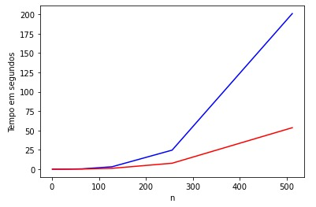

# Trabalho-final-AA
Trabalho final de análise de algoritmos

# Integrantes

Douglas Gomes de Paula (11621BCC013)

Vinicius Guardieiro Sousa (11811BCC008)

# Introdução

O intuito deste trabalho é demonstrar a eficiência do algoritmo de multiplicação de duas matrizes de Strassen em relação ao algoritmo de multiplicação de duas matrizes comum.

Utilizamos a linguagem Python. Essa escolha foi feita justamente por Python abstrair o controle de memória durante a alocação das estruturas necessárias para gerar/tratar as matrizes no algoritmo de Strassen a cada recursão, retirando a necessidade de cuidado quanto a essa parte da implementação do algoritmo para realizar o experimento.

# Testes feitos

Foram criados 400 pares de matrizes ao todo para a comparação, sendo 40 matrizes para cada n. As matrizes utilizadas neste experimento são quadráticas de dimensão nxn, onde n variou de 1 a 512. Mantemos o n sendo potência de 2 pela necessidade que o algoritmo de multiplicação de Strassen tem, as matrizes sempre são divididas em quatro matrizes menores, porém de mesma dimensão, recursivamente.

Na figura abaixo, o tempo (em segundos) mostra a média entre o tempo gasto para realizar cada multiplicação dos pares de matrizes nxn nos respectivos algoritmos.

# Resultados

Comparando o tempo de cada algoritmo, nota-se a diferença, mesmo que muito pequena, já no primeiro caso de teste com matrizes de dimensão 1x1. Porém a diferença começa a ficar considerável a partir da dimensão 128x128, onde já se nota a diferença em segundos com Strassen se mostrando mais eficiente.

Colocando esses resultados em gráfico é possível observar que o resultado deste experimento se assemelha com o comportamento das funções assintóticas que exprimem as complexidades dos respectivos algoritmos utilizados, sendo a multiplicação de duas matrizes comum f(n) = n³ representada pela linha azul e multiplicação de duas matrizes de Strassen g(n) = n ^ (log 7) representada pela linha vermelha, onde o log 7 é na base 2.

# Vídeo explicando o código
Verifique um vídeo onde fizemos a execução de um experimento e, também, explicamos brevemente como o algoritmo foi implementado na linguagem Python: https://youtu.be/doW48yPazJw

